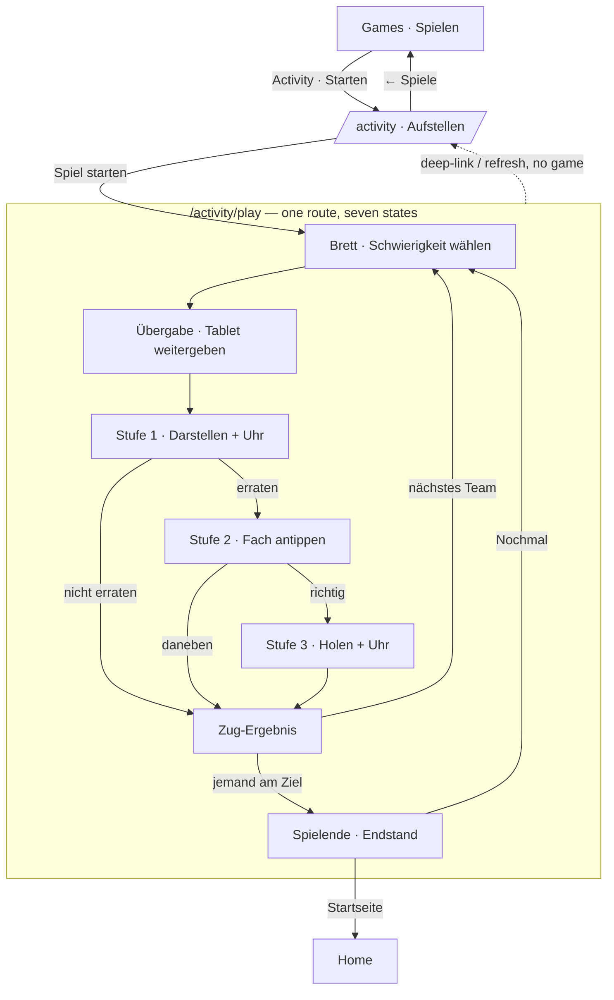
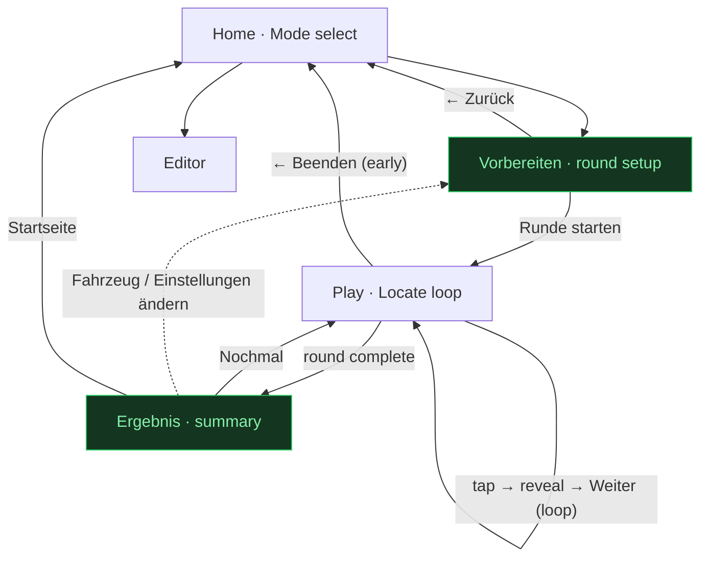
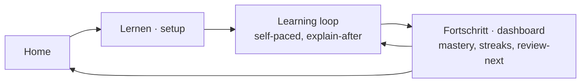
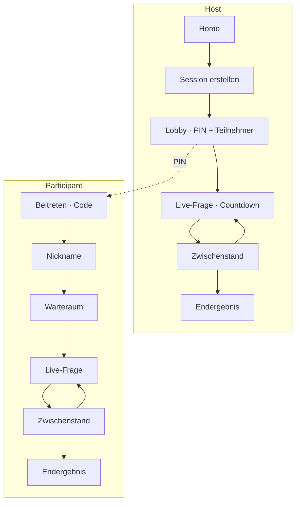
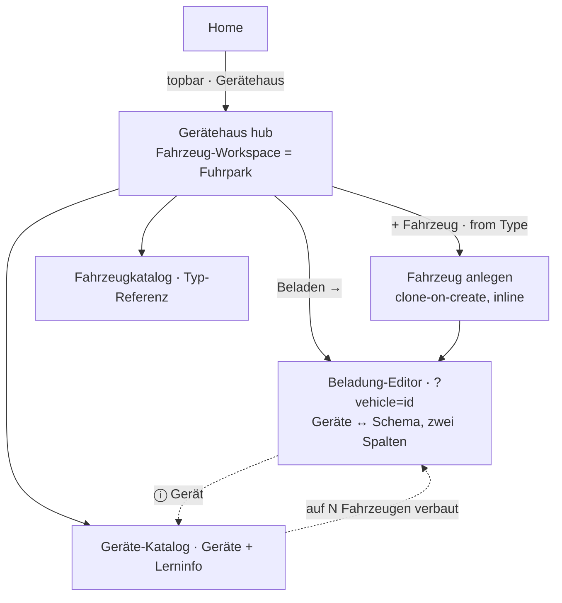
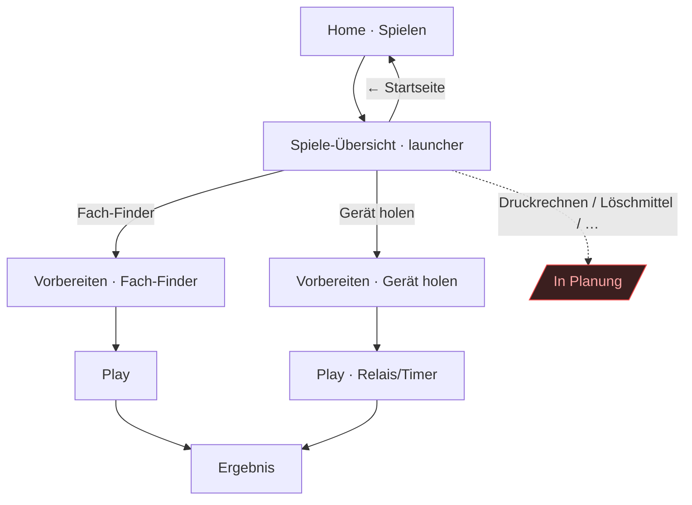

# Agni — Screen Flow & Information Architecture

> **Living document.** This is the canonical map of *how the app's screens
> connect* and *why*. It records the shipped v1 flow, the target UX (what we're
> steering toward), and the roadmap flows for future modes. Update it in the same
> PR whenever you add a route, a screen, or change a transition — see
> [Maintenance](#maintenance) at the bottom.
>
> Companions: the [UI/UX brief](./ui-ux-brief.md) (what each screen *is*), the
> HTML mockups in [`screens/`](./screens/), and the [ADRs](../adr/) (why the
> architecture is shaped this way — esp. ADR-0004 modes, ADR-0005 responsive).

---

## 1. Principles

The flow is designed around who is using the app and where:

- **One task per screen.** A firefighter at the truck, often one-handed or
  gloved, should never wonder what this screen is for. Each screen has a single
  goal and one obvious primary action.
- **Baseline = phone portrait** (ADR-0005). Every flow must work in a single
  column; wide screens are an enhancement, never a requirement.
- **Author-paced, interruptible.** In-Person rounds run on one shared device and
  can be quit at any point without losing the app. No flow traps the user.
- **Modes are peers, added not retrofitted** (ADR-0004). In-Person, Learning and
  Online PvP each own a *Session driver*; they branch from Home and reconverge on
  a shared result surface. New modes slot in beside the existing ones.
- **Local-first, account-optional** (ADR-0002). Auth only gates content when the
  Supabase adapter is active; in local mode the guards are no-ops.

---

## 2. Route map

Source of truth: `src/app/app.routes.ts`. All content routes are lazy-loaded.

| Route      | Component | Guard         | Status        | Purpose |
|------------|-----------|---------------|---------------|---------|
| `/` → `/home` | —      | —             | shipped       | Redirect to landing. |
| `/login`   | `Login`   | —             | shipped       | Email/password + Google sign-in. |
| `/signup`  | `Signup`  | —             | shipped       | Create account; may need email confirm. |
| `/home`    | `Home`    | `authGuard`   | shipped       | Landing / mode select — H1 `Üben`, one playable mode (In-Person) + roadmap strip; the Gerätehaus chip and `Abmelden` sit in the utility row (§6). |
| `/games`   | `Games`   | `authGuard`   | shipped       | Game-mode launcher: catalog of games (verfügbar + roadmap). Home In-Person CTA lands here; games start `/select`. See §5.6. |
| `/select`  | `Select`  | `authGuard`   | shipped       | Round setup — vehicle chooser + question count (§5.2). |
| `/play`    | `Play`    | `authGuard`   | shipped       | In-Person **Locate** round loop **plus the round summary** (a state, not a route). Runs on *round chrome* — no brand topbar, no footer. |
| `/activity` | `ActivitySetup` | `authGuard` | shipped   | Activity setup as a **sequential onboarding wizard** — 1 Wer spielt? · 2 Woran? · 3 Was zählt? (Stufen + Feineinstellung). Steps are states, not routes; `Weiter`/`Zurück` are the only navigation and `Weiter` never blocks, but `Spiel starten` exists only on step 3 and is gated. Its own screen because `/select` is deliberately lean (§5.2). |
| `/activity/play` | `ActivityPlay` | `authGuard` | shipped | Activity Zug loop: board → Übergabe → Darstellen → Verorten → Holen → Zug-Ergebnis → Spielende. **All seven are states, not routes** — same reasoning as the Play summary below. Round chrome. |
| `/geraetehaus` | `Geraetehaus` | `authGuard` | shipped | Content home / hub — vehicle workspace (the roster) + Katalog/Fahrzeugkatalog reference strip (§7.3). |
| `/geraetehaus/katalog` | `Katalog` | `authGuard` | shipped | Geräte-Katalog: Equipment list + educational detail. |
| `/geraetehaus/fahrzeugkatalog` | `Fahrzeugkatalog` | `authGuard` | shipped | Vehicle-Type master data (Ordnungsnummer 10–90) as reference. |
| ~~`/geraetehaus/fuhrpark`~~ | `Fuhrpark` | — | **dropped** (`ee9a9c8`) | Standalone roster; duplicated the hub's own workspace, so it was folded into `/geraetehaus`. |
| `/geraetehaus/beladung` | `Beladung` | `authGuard` | **proposed** | Read-only vehicle picker → workbench. Not built: the hub's per-row **Beladen →** deep-links into the editor instead. |
| `/geraetehaus/beladung/:vehicleId` | `Werkbank` | `authGuard` | **proposed** | Loadout workbench (evolved **Editor**; replaces `/editor`). |
| `/editor`  | `Editor`  | `authGuard`   | shipped → migrate | Loadout workbench: Geräte left, schematic right, **bidirectional highlighting**; folds into the Beladung-Werkbank. Deep-linked as `?vehicle=<id>`. |
| ~~`/result`~~ | —      | —             | **dropped**   | Round summary shipped as a *state of `/play`* instead — it reads the round's answer log, which a separate route would have to carry or refetch (see §3). |
| `**` → `/home` | —     | —             | shipped       | Unknown paths fall back to Home. |

`authGuard` is a **no-op unless `USE_SUPABASE`** is on; when on it awaits session
restore, then allows or returns `/login`.

---

## 3. Current flow (v1, as shipped)

```mermaid
flowchart TD
    start([App load: /]) --> guard{Authenticated?<br/>(only if Supabase on)}
    guard -- no --> login[Login]
    guard -- yes --> home[Home · Mode select]

    login -- "Registrieren" --> signup[Signup]
    signup -- "Anmelden" --> login
    login -- success --> home
    signup -- "success / confirmed" --> home
    signup -. "needs email confirm" .-> signup

    home -- "Spiel starten" --> games[Games · Spiele-Übersicht]
    home -- "Gerätehaus" --> haus[Gerätehaus · Hub]
    home -- "Abmelden" --> login

    games -- "Starten →" --> select[Select · Vorbereiten]
    games -- "← Startseite" --> home
    haus -- "Beladen →" --> editor[Editor]
    haus -- "← Startseite" --> home

    select -- "pick vehicle" --> play[Play · Locate loop]
    select -- "← Zurück" --> home
    editor -- "← Zurück" --> haus

    play -- "tap → reveal → Weiter (loop)" --> play
    play -- "← Beenden" --> home
    play -. "deep-link / refresh, no session" .-> select
    play -. "equipment exhausted" .-> deadend[/"Empty state:<br/>Keine Gegenstände"/]:::gap

    classDef gap fill:#3b1f1f,stroke:#ef4444,color:#fca5a5;
```

**Activity** (shipped 2026-07-25) hangs off the same launcher but runs its own pair
of screens, because a Zug is a chain and not a question:



Stufen 2 and 3 are skipped when switched off at setup; with both off, `perform`
goes straight to `turn`. A failed Stufe always lands on `Zug-Ergebnis` with the
points banked so far — the strict chain (ADR-0006).

**What works:** the spine (Login → Home → Select → Play) is clean, every screen
has an explicit in-app back, and deep-link/refresh into `/play` safely bounces to
`/select`.

**Where it breaks down (the red node):** ~~a round has no ending~~ — **resolved
2026-07-25.** The round now ends on a real summary (`finished()`): score over the
question count, a quota bar, and a **review list naming every missed Gerät with
the Fach it belonged in**, then `Nochmal` / `Startseite`. The "Keine Gegenstände
zum Üben" state is now only what it always should have been — the empty state for a
vehicle with nothing verlastet, pointing at the Gerätehaus.

The summary is a **state of `/play`**, not its own route: it needs the round's
answer log, and a separate route would have to either carry it or refetch it.
`Ergebnis` in the target diagram below is therefore a screen *state*, not a URL.

---

## 4. Target flow (v1+, what we're steering toward)

Two changes turn the loop into a satisfying session, both additive (no data-layer
changes — ADR-0004 layers 1–2 untouched):



Green = new/upgraded; both are now **shipped** (`prep` = `/select`, `result` = the
`finished()` state of `/play`). Two deliberate departures from the sketch above:

- **`← Beenden` mid-round goes Home, not to the summary.** Leaving early is
  abandoning the round, not finishing it — scoring a partial round would put a
  number on a drill nobody completed.
- **"Einstellungen ändern" (dotted) is not built.** From the summary you can only
  repeat the same round or leave; re-configuring means going through `/select`.

---

## 5. UX findings & recommendations

Prioritised. Each maps to the gaps above.

### 5.1 Add a round-result screen — **P1, highest value**
A round must end on an **Ergebnis** screen, not an empty state:
- Score (`richtig / gesamt`), percentage, and time if tracked.
- Weak spots — which items/compartments were missed, so the next round or the
  real-truck walk-through can target them.
- Actions: **Nochmal** (same setup), **Ändern** (back to Vorbereiten),
  **Fertig** (Home).
- Reached both on natural completion *and* on early "Beenden" (show partial).

Implementation seam: a new `/result` route reading the existing
`InPersonSessionStore` tallies; the store already holds `asked` / `correctCount`.
Distinguish "round finished" from "vehicle has no equipment" (a real empty/error
state that should surface back on Vorbereiten, not as a result of 0/0).

### 5.2 Grow `Select` into `Vorbereiten` — **P2**
**Shipped.** `/select` is now a lean **chooser**, not a configurator: pick the
Vehicle (card when the fleet is one, list when it's several) + question count,
then start.
- **Deliberately excluded:** the mockup [`03`](./screens/03-vorbereiten.html) also
  drew per-round **compartment scope** and **ordering** controls. Both were cut —
  they turn a "grab the tablet, drill at the truck" entry point into a
  power-user configurator, and scoping which compartments are in play edges into
  Editor/Library territory. Question count is the only round knob here in v1.
- **Single-vehicle case:** the one Vehicle is pre-selected and the screen stands
  as a confirmation rather than silently skipping — keeps a predictable
  Home → game → setup → Play rhythm and a home for count. The fleet is expected to
  grow, so the chooser earns its place; the vehicle block's own label carries the
  distinction (*Dienstfahrzeug* vs *Fahrzeug*). The **title no longer flips**
  (it was *"Bereit?"* / *"Fahrzeug wählen."*): it is the bare screen noun
  *"Vorbereiten"*, since the labelled blocks below already instruct (§7a.2).
- As challenge types (§7) arrive, they slot in here without a new screen.
- Empty state: a Vehicle with no Placements disables Start and points to the
  Editor, rather than launching a 0/0 round.

### 5.3 Preserve the requested URL through login — **P3**
`authGuard` returns `/login` and login always lands on `/home`, so a deep link to
`/editor` while signed-out sends the user to Home instead of the editor. Capture
the attempted URL (guard returns `/login?returnUrl=…`) and honor it after
sign-in. Low effort, removes a small daily papercut once Supabase is on.

### 5.4 Make back-navigation predictable — **P3**
Transitions use `replaceUrl: true` liberally, so browser **Back** is
unpredictable (e.g. from `/play`, Back does not return to `/select`). Policy:
- **One-shot / terminal transitions** keep `replaceUrl` (login→home, the
  no-session play→select bounce, quit→home) — you should not be able to Back into
  them.
- **User-meaningful steps** (Home → Vorbereiten → Play → Ergebnis) rely on the
  explicit in-app back/primary buttons, which every screen already has. Treat
  browser-Back as best-effort; never require it for a flow to work.

### 5.6 Introduce the Game-mode launcher — **P2 (new)**
Game mode is a *container of games*, not a single game (see
[game-catalog](./game-catalog.md)). The games are heterogeneous — a schematic
game (Fach-Finder) has a vehicle and compartments; a calc game (Druckrechnen) has
neither — so game selection cannot stay a "Fragetyp" chip on one Locate-shaped
setup screen (as `03-vorbereiten` currently models it). Promote it to its own
screen:

- **Reframe Home's first card** from "In-Person" (a *context*) to **"Spielen"**
  (the *mode*). In-person vs solo becomes a per-game property surfaced as card
  meta, not a top-level mode. Home stays three peer modes (ADR-0004): Spielen,
  Lernen, Online-Duell.
- **New `/games` launcher** (mockup [`04`](./screens/04-spiele-uebersicht.html)) —
  a **Verfügbar** section (rich cards with a "Starten →" CTA; the recommended game
  carries the `--signal` top rule) plus an **In Planung** roadmap. Communicates the
  roadmap and keeps the `Home → pick → setup → play` rhythm even while few games
  are live. **Restyled 2026-07-25 to the Gerätehaus hub shape:** the roadmap's
  six near-equal cards (hatched, each with its own "In Planung" badge) became a
  quiet **reference strip** — six roadmap entries that look as heavy as the two
  playable ones invite six taps that go nowhere. Mockup `04` still shows the old
  weighting.
- **`03-vorbereiten` drops its "Fragetyp" chip block** — the game is chosen
  upstream now — and becomes the *Fach-Finder* setup: the template other
  schematic games reuse. Calc/quiz games get a sibling setup variant (no vehicle
  block). All variants still converge on Play → Ergebnis (§5.1).
- **One-game guard:** never show the launcher with a single playable game *and* no
  roadmap worth seeing — but here the roadmap itself is the reason to keep it.

### 5.5 Resolve the design-language split — **nearly closed**
The migration to the light/dark **"C" blueprint** language is done for every screen
except **`signup`**, which still has no root class and still uses `hlmBtn` +
firetruck text tokens. (`play` was the last real holdout and migrated 2026-07-25 —
see design-guidelines §0/§6 *round chrome*.) The interactive sketch renderers keep
the firetruck instrument palette **on purpose**, as does the app-shell offline
banner in `app.ts`. Remaining work: migrate `signup` to match `login`, then delete
whatever of `styles.css` no longer has a caller.

Now that nine screens duplicate the same token block, extracting
`src/app/shared/styles/blueprint.scss` is the overdue follow-up — it is also what
would clear the two standing budget warnings (initial bundle 512.5 kB vs 500 kB,
`geraetehaus.scss` 13.9 kB vs 12 kB).

---

## 6. Cross-cutting behaviours

- **Auth boundary.** Only `/login` and `/signup` are public. Everything else is
  behind `authGuard`, which is inert in local mode. Google OAuth redirects out and
  returns into the app; the guard's `whenReady()` prevents a restore-race bounce.
- **Offline / PWA** (ADR-0002, ADR-0005). v1 is fully playable offline via the
  local `ContentStore` adapter; the auth screen advertises this ("Offline-fähig").
  Flows must not hard-depend on network — a failed sign-in degrades to local play
  where applicable.
- **Per-screen states.** Each screen should handle **loading**, **empty**, and
  **error** explicitly (the brief calls these out). Play carries four: **asking**,
  **reveal-correct**, **reveal-incorrect** and **finished**; Activity's round screen
  carries seven (see §3) plus its own empty state ("keine Karten für dieses
  Fahrzeug"). Correctness is conveyed by icon + label + the named Fach, not colour
  alone (colour-blind support).
- **Card privacy on a shared device.** Activity puts an explicit **Übergabe**
  interstitial between drawing a card and showing it. One tablet, a crew clustered
  round it, and one mistimed tap ends the Zug before it starts — the hand-off is a
  state, not a hint.
- **Jump-free hub chrome.** Every browsed screen stacks the same three rows —
  topbar, a 38px chip row, then the `page-head` — with the same shell padding and
  gap, so moving between Home and any hub screen never shifts the H1. Home has no
  back chip, so it fills that slot with its own **utility row**: the
  `Gerätehaus →` chip (mirroring the `‹ Startseite` chip that will sit on that exact
  pixel one screen later) and `Abmelden`, which is Home's job alone. Don't add a
  screen that skips the row — reserve it, or the content jumps on navigation.
- **Safe-area insets.** Root layout padding respects `env(safe-area-inset-*)` so
  headers/footers clear the notch in standalone PWA mode.
- **Session lifetime.** In-Person session state lives in a root-provided store and
  does not survive a refresh — hence the deep-link bounce. Rounds are meant to be
  short and restartable, so this is acceptable; do not add persistence without a
  reason. Activity is the same: teams, board and score die with the game, and the
  solo "Zügen bis Ziel" is shown at the end but never stored (a Bestenliste waits on
  the Learning-mode progression model).

---

## 7. Roadmap flows (future — design the vision, mark as future)

These are not built. They branch from Home as peer modes (ADR-0004) and reconverge
on a shared **Ergebnis/Scoreboard** surface. Kept here so new work has a target.

### 7.1 Learning mode (solo, self-paced, progress-tracked)



### 7.2 Online PvP (Kahoot-style, multi-device)



Participants need **no account** (nickname + code only). Realtime coordination is
quarantined in the Online PvP session driver.

### 7.3 Gerätehaus — content management (author)

The Author's content home (CONTEXT: **Gerätehaus** = user-facing front door to the
**Library**). Structured around one insight: **two independent source lists and
the join between them**.

- **Fuhrpark** (Vehicles) and **Geräte-Katalog** (Equipment) are self-standing —
  a truck exists without its kit, a Gerät without any truck.
- **Beladung** (Placements) can't exist without both — it *is* Vehicle ×
  Compartment × Gerät. So it's a **workbench that consumes the two source lists**,
  not a third parallel silo.



**Roles & verbs (the anti-duplication rule):**
- The **hub's workspace zone** owns the vehicle **roster** — the *only* place to
  add (from a Vehicle Type, clone-on-create per ADR-0001), rename, or remove a
  Vehicle. Rows show loadout status and a **Beladen →** shortcut. There is no
  separate Fuhrpark screen: a standalone roster page repeated the hub's own
  primary content, so it was folded in (`ee9a9c8`) — **the hub *is* the Fuhrpark**.
- **Beladung** never owns a roster. The planned landing is a **read-only vehicle
  picker** ("Welches Fahrzeug beladen?") — same vehicles, no CRUD — then the
  workbench. Today the hub's per-row **Beladen →** deep-links straight into the
  editor, which keeps the different verb (*beladen* vs *verwalten*) without a
  second list to maintain.
- **Beladung-Werkbank** is the evolved **Editor** (replaces `/editor`). The
  **workbench itself shipped ahead of the route move**: a two-pane split with the
  Geräte-Katalog left and the vehicle schematic right, where bidirectional
  Placement editing runs **without a mode switch** — tap a **Fach** and its Geräte
  sort to the top of the list with a green check; tap a **Gerät** and every Fach
  carrying it turns green on the schematic (one Gerät may sit in several, which is
  what this makes visible). Only a row's check button writes; schematic taps just
  move the focus, so tracing a Gerät can't place it by accident. Layout stays a
  Type property, not author-editable in v1. **Still owed by the move:** the
  `/geraetehaus/beladung` picker and the ⓘ Gerät → Katalog cross-link.
- **Geräte-Katalog** owns the shared Equipment list + educational detail (what a
  Gerät is / how it's used). Vehicle-independent.

**Cross-links keep it cohesive (no silos):** Fuhrpark→Beladung (Beladen), Katalog
Gerät→"auf N Fahrzeugen"→that truck's Beladung, and in the Werkbank each Gerät
carries an ⓘ→its Katalog entry.

**ADR-0003 gate:** the generic metadata renderer has landed (`de2a3d6`), so every
type carrying a compartment layout is loadable and playable — the LF through
`LfSketch`, HLF 20 / TLF 3000 / TSF-W through metadata boxes. What stays gated is
narrower: the Fahrzeugkatalog **master-data stubs** with no compartments at all.
The hub still lists and creates them, but marks those rows locked and disables
Beladen/Play — never drop the user into an empty editor.

**Home entry:** the old Home "Vorbereiten" prep tiles (Beladung bearbeiten +
single Dienstfahrzeug) are replaced by a single **Gerätehaus** entry in the Home
topbar — content management is a utility destination, not a body CTA, and one
entry scales to a fleet where a single-vehicle tile does not.

### 7.4 Other challenge types
**Identify**, **Name-loadout**, **True/False** (brief §7) are *presentation +
engine* variants, **not** new screens — they render inside the existing Play
surface and are selected in Vorbereiten (§5.2). Multi-step timed challenges add a
step-progression + timer overlay to Play, still ending on Ergebnis.

---

### 7.5 Game mode as a game catalog (near-term — see §5.6)

The launcher wraps the existing single-game flow rather than replacing it:



Each game maps to an engine (schematic / calc / quiz / sequence / physical) per the
catalog; a game is *content + rule config* on an engine, so new games slot into the
launcher and reuse a setup template without new plumbing. Online-Duell (§7.2) later
wraps any launcher game in the Kahoot loop.

## 8. Screen inventory

| # | Screen | Route | Mockup | Status | Primary action | Exits |
|---|--------|-------|--------|--------|----------------|-------|
| 1 | Login | `/login` | [01](./screens/01-anmelden.html) | shipped | Anmelden | Home; → Signup |
| 1 | Signup | `/signup` | 01 | shipped | Registrieren | Home; → Login |
| 2 | Home / Mode select (`Üben`) | `/home` | [02](./screens/02-startseite.html) | shipped | Spiel starten | Games; Gerätehaus; Login |
| 2b | Spiele-Übersicht (launcher) | `/games` | [04](./screens/04-spiele-uebersicht.html) | shipped | Spiel starten | Vorbereiten; Home |
| 3 | Vorbereiten (Select) | `/select` | [03](./screens/03-vorbereiten.html) | shipped | Runde starten | Play; Games; Home |
| 4 | Play · Locate | `/play` | — | shipped | tap compartment | Ergebnis (same route); Home |
| 5 | Ergebnis | `/play` (`finished()` state) | — | shipped | Nochmal | Play; Home |
| 5a | Activity · Aufstellen (3-step onboarding wizard) | `/activity` | — | shipped | Weiter → Spiel starten | Activity-Zug; Games |
| 5b | Activity · Zug | `/activity/play` | — | shipped | Schwierigkeit / Stufe lösen | Spielende (same route); Home |
| 5c | Activity · Spielende | `/activity/play` (`over` state) | — | shipped | Nochmal | Zug; Home |
| 6 | Gerätehaus (hub) | `/geraetehaus` | [05](./screens/05-geraetehaus.html) | shipped | Beladen (per vehicle row) | Editor; Katalog; Fahrzeugkatalog; Home |
| 6a | ~~Fuhrpark~~ | ~~`/geraetehaus/fuhrpark`~~ | [06](./screens/06-fuhrpark.html) | **dropped** — roster lives on the hub | — | — |
| 6b | Geräte-Katalog | `/geraetehaus/katalog` | [07](./screens/07-geraete-katalog.html) | shipped | Gerät bearbeiten | Gerätehaus |
| 6b′ | Fahrzeugkatalog | `/geraetehaus/fahrzeugkatalog` | — | shipped | Typ nachschlagen | Gerätehaus |
| 6c | Beladung (picker) | `/geraetehaus/beladung` | [08](./screens/08-beladung.html) | **proposed** | Fahrzeug wählen | Werkbank; Gerätehaus |
| 6d | Beladung-Werkbank | `/geraetehaus/beladung/:id` | — (editor grill) | **proposed** — editing itself shipped in 7 | Fächer bestücken | Katalog; Beladung |
| 7 | Editor (→ Werkbank) | `/editor` | — | shipped, migrating | Fach bestücken (Liste ↔ Schema) | Gerätehaus |
| 8 | Lernen + dashboard | — | — | future | — | Home |
| 9 | Online PvP (host/join set) | — | — | future | — | Home |

---

## Maintenance

Update this doc **in the same PR** as the change, whenever you:
- add/remove/rename a **route** → update §2 and §8;
- add a **screen** or change a **transition** → update the relevant diagram
  (§3/§4/§7) and §8;
- resolve one of the **recommendations** (§5) → move it out of the list and
  reflect it in §3/§4, or delete it;
- start a new **mode** → add its subgraph in §7 and promote to §3/§4 when shipped.

Keep the diagrams as the quick-glance truth; keep the tables authoritative. If a
decision behind a flow is non-obvious or contested, record it as an
[ADR](../adr/) and link it here rather than arguing it inline.

### Changelog
| Date | Change |
|------|--------|
| 2026-07-24 | Initial version: documented v1 flow, identified the missing round-result screen and thin Select, proposed target flow + roadmap subgraphs. |
| 2026-07-24 | Added Game-mode launcher (§5.6, §7.5, mockup `04`): reframe Home card In-Person→Spielen, promote game selection out of Vorbereiten into a `/games` catalog. Route map + inventory updated. |
| 2026-07-24 | Built `/select` round setup (mockup `03`), carrying the launcher's `?game=` through to a fixed-length round; Play gained an end summary (`Nochmal`/`Startseite`), so `/result` stays proposed for now. |
| 2026-07-24 | Scoped `/select` down to a **chooser** (vehicle + question count): cut the mockup's compartment-scope and ordering controls — they made the game entry point a configurator and leaked Editor concerns. Recorded in §5.2. |
| 2026-07-25 | Applied the same two hub conventions to **`/select`**: back-chip to a `.shell` child, and a static bare-noun H1 **`Vorbereiten`** in place of the *"Bereit?"* / *"Fahrzeug wählen."* flip — §5.2 updated, since that flip was a documented decision. |
| 2026-07-25 | Restyled **`/games`** onto the Gerätehaus hub shape (§5.6): roadmap demoted from six hatched cards to a quiet reference strip, quiet section labels, bare-noun H1, hub back-chip placement, topbar reduced to avatar + toggle. Mockup `04` now lags the implementation on roadmap weighting. |
| 2026-07-25 | **`/activity` setup restructured into a 3-step flow** (Teams → Fahrzeug → Stufen), states of one route as with the Zug loop and the `/play` summary. First built with clickable step chips so the "start with the defaults" path stayed one tap; reworked the same day into a **sequential onboarding wizard** on request — inert progress rail, question-as-headline, `Weiter`/`Zurück` only, `Spiel starten` on the last step. The cost is real and accepted: starting a default game is now three taps rather than one. `Weiter` deliberately still never blocks, because Stufe 2 (step 3) decides whether step 2's vehicle needs a Fach-Layout and paging forward became the only route to that fix. |
| 2026-07-25 | Shipped **Activity** as `/activity` + `/activity/play` (§2, §3, §8 rows 5a–5c). Setup is its own screen rather than a `/select` branch — teams, Stufen toggles, points and two clocks would have doubled a screen deliberately kept lean (§5.2). The Zug's seven phases are **states of one route**, following the `/play` summary precedent: they share the session store and a separate route would have to carry or refetch it. New cross-cutting behaviour: the **Übergabe** interstitial, because a card must reach the performer before it reaches the room (§6). |
| 2026-07-25 | Redesigned **`/play`** into "C" *round chrome* and **closed the §3 red node**: the summary now names every missed Gerät and the Fach it belonged in (new `answers`/`missed` log on `InPersonSessionStore`). **`/result` dropped** — the summary is a state of `/play`, since it reads the round's answer log (§3, §8 rows 4–5). Recorded two departures from the §4 target sketch: `Beenden` mid-round goes Home rather than scoring a partial round, and "Einstellungen ändern" from the summary is not built. §5.5 narrowed to `signup` as the last firetruck screen. |
| 2026-07-25 | Rebuilt **`/home`** on the hub shape — the last screen on the original mode-grid. H1 `Wähle einen Modus.` → the bare noun **`Üben`**; In-Person became one full-width panel row (the Gerätehaus vehicle-row shape) and Lernen / Online-Duell a quiet `In Planung` strip; topbar reduced to avatar + theme toggle. Added the **jump-free hub chrome** rule to §6: the chip row is a fixed 38px slot, so Home fills it with a **utility row** (`Gerätehaus →` chip + `Abmelden`) instead of leaving it out — its chip lands on the same pixel as the `‹ Startseite` chip on the screen it opens, and the H1 no longer shifts on navigation. Also corrected §3's stale Home edges (it still drew `Home → Select` and `Home → Editor`; both go through `/games` and `/geraetehaus` now) and row 2 of §8. |
