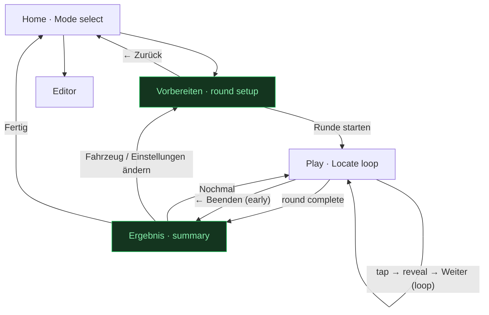
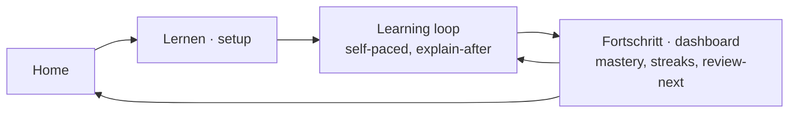
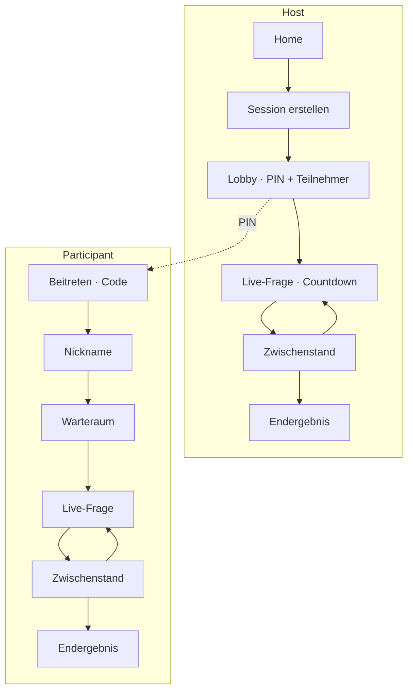
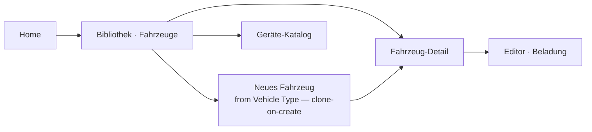
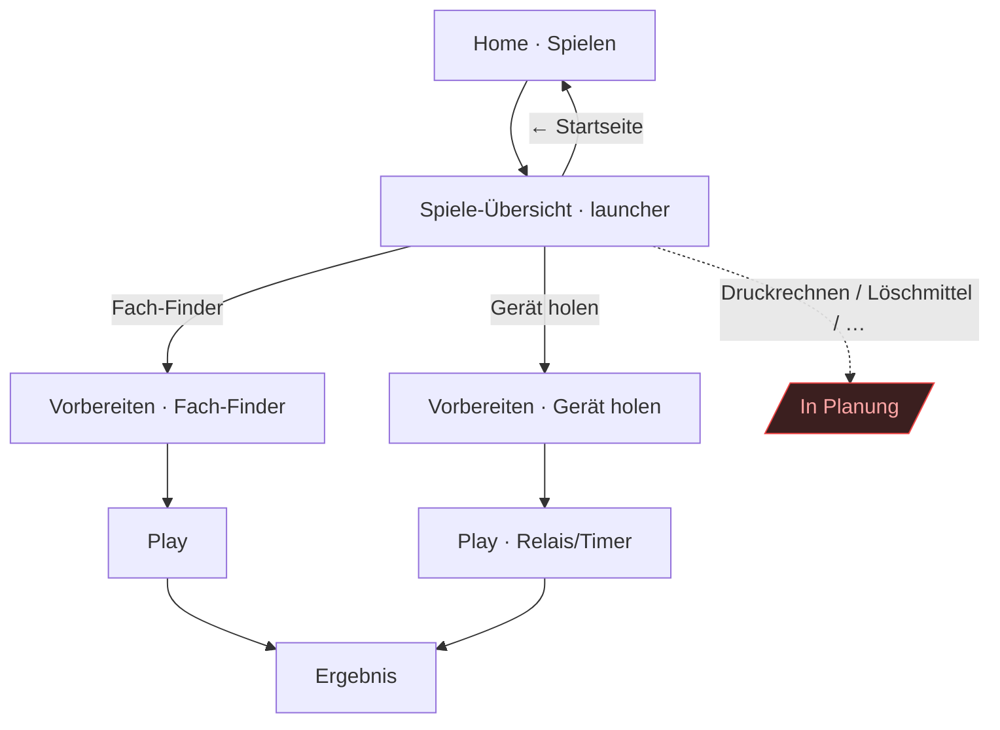

# Agni — Screen Flow & Information Architecture

> **Living document.** This is the canonical map of *how the app's screens
> connect* and *why*. It records the shipped v1 flow, the target UX (what we're
> steering toward), and the roadmap flows for future modes. Update it in the same
> PR whenever you add a route, a screen, or change a transition — see
> [Maintenance](#maintenance) at the bottom.
>
> Companions: the [UI/UX brief](./ui-ux-brief.md) (what each screen *is*), the
> HTML mockups in [`screens/`](./screens/), and the [ADRs](../adr/) (why the
> architecture is shaped this way — esp. ADR-0004 modes, ADR-0005 responsive).

---

## 1. Principles

The flow is designed around who is using the app and where:

- **One task per screen.** A firefighter at the truck, often one-handed or
  gloved, should never wonder what this screen is for. Each screen has a single
  goal and one obvious primary action.
- **Baseline = phone portrait** (ADR-0005). Every flow must work in a single
  column; wide screens are an enhancement, never a requirement.
- **Author-paced, interruptible.** In-Person rounds run on one shared device and
  can be quit at any point without losing the app. No flow traps the user.
- **Modes are peers, added not retrofitted** (ADR-0004). In-Person, Learning and
  Online PvP each own a *Session driver*; they branch from Home and reconverge on
  a shared result surface. New modes slot in beside the existing ones.
- **Local-first, account-optional** (ADR-0002). Auth only gates content when the
  Supabase adapter is active; in local mode the guards are no-ops.

---

## 2. Route map

Source of truth: `src/app/app.routes.ts`. All content routes are lazy-loaded.

| Route      | Component | Guard         | Status        | Purpose |
|------------|-----------|---------------|---------------|---------|
| `/` → `/home` | —      | —             | shipped       | Redirect to landing. |
| `/login`   | `Login`   | —             | shipped       | Email/password + Google sign-in. |
| `/signup`  | `Signup`  | —             | shipped       | Create account; may need email confirm. |
| `/home`    | `Home`    | `authGuard`   | shipped       | Landing / mode select (Spielen · Lernen · Online-Duell) + author entry. |
| `/games`   | `Games`   | `authGuard`   | **proposed**  | Game-mode launcher: catalog of games (verfügbar + roadmap). See §5.6. |
| `/select`  | `Select`  | `authGuard`   | shipped (thin)| Per-game setup (starts with Fach-Finder). → grows into **Vorbereiten**. |
| `/play`    | `Play`    | `authGuard`   | shipped       | In-Person **Locate** round loop. |
| `/editor`  | `Editor`  | `authGuard`   | shipped       | Author loadout editor (Placements). |
| `/result`  | —         | `authGuard`   | **proposed**  | Round summary / Ergebnis (see §5.1). |
| `**` → `/home` | —     | —             | shipped       | Unknown paths fall back to Home. |

`authGuard` is a **no-op unless `USE_SUPABASE`** is on; when on it awaits session
restore, then allows or returns `/login`.

---

## 3. Current flow (v1, as shipped)

```mermaid
flowchart TD
    start([App load: /]) --> guard{Authenticated?<br/>(only if Supabase on)}
    guard -- no --> login[Login]
    guard -- yes --> home[Home · Mode select]

    login -- "Registrieren" --> signup[Signup]
    signup -- "Anmelden" --> login
    login -- success --> home
    signup -- "success / confirmed" --> home
    signup -. "needs email confirm" .-> signup

    home -- "🚒 In-Person starten" --> select[Select · Fahrzeug wählen]
    home -- "🧰 Beladung bearbeiten" --> editor[Editor]
    home -- "Abmelden" --> login

    select -- "pick vehicle" --> play[Play · Locate loop]
    select -- "← Zurück" --> home
    editor -- "← Zurück" --> home

    play -- "tap → reveal → Weiter (loop)" --> play
    play -- "← Beenden" --> home
    play -. "deep-link / refresh, no session" .-> select
    play -. "equipment exhausted" .-> deadend[/"Empty state:<br/>Keine Gegenstände"/]:::gap

    classDef gap fill:#3b1f1f,stroke:#ef4444,color:#fca5a5;
```

**What works:** the spine (Login → Home → Select → Play) is clean, every screen
has an explicit in-app back, and deep-link/refresh into `/play` safely bounces to
`/select`.

**Where it breaks down (the red node):** a round has no ending. When the picker
runs out of equipment, `current` becomes `null` and the player is dropped on a
bare "Keine Gegenstände zum Üben" message — the same empty state used for a
mis-configured vehicle. There is no score recap, no "play again", no sense of
completion.

---

## 4. Target flow (v1+, what we're steering toward)

Two changes turn the loop into a satisfying session, both additive (no data-layer
changes — ADR-0004 layers 1–2 untouched):



Green = new/upgraded. Everything else is unchanged.

---

## 5. UX findings & recommendations

Prioritised. Each maps to the gaps above.

### 5.1 Add a round-result screen — **P1, highest value**
A round must end on an **Ergebnis** screen, not an empty state:
- Score (`richtig / gesamt`), percentage, and time if tracked.
- Weak spots — which items/compartments were missed, so the next round or the
  real-truck walk-through can target them.
- Actions: **Nochmal** (same setup), **Ändern** (back to Vorbereiten),
  **Fertig** (Home).
- Reached both on natural completion *and* on early "Beenden" (show partial).

Implementation seam: a new `/result` route reading the existing
`InPersonSessionStore` tallies; the store already holds `asked` / `correctCount`.
Distinguish "round finished" from "vehicle has no equipment" (a real empty/error
state that should surface back on Vorbereiten, not as a result of 0/0).

### 5.2 Grow `Select` into `Vorbereiten` — **P2**
Today `/select` is a bare vehicle list that jumps straight into `/play`. The
mockup [`03-vorbereiten.html`](./screens/03-vorbereiten.html) envisions a real
round-setup surface: vehicle **+** (future) challenge types **+** item count.
- Keep it as the single setup screen; rename the concept to **Vorbereiten**.
- **Single-vehicle shortcut:** when the Library has exactly one vehicle and there
  is nothing else to configure, pre-select it — but still show the screen as the
  "ready?" confirmation rather than silently skipping (keeps a predictable
  Home → setup → play rhythm and a place for round length).
- As challenge types (§7) arrive, they slot in here without a new screen.

### 5.3 Preserve the requested URL through login — **P3**
`authGuard` returns `/login` and login always lands on `/home`, so a deep link to
`/editor` while signed-out sends the user to Home instead of the editor. Capture
the attempted URL (guard returns `/login?returnUrl=…`) and honor it after
sign-in. Low effort, removes a small daily papercut once Supabase is on.

### 5.4 Make back-navigation predictable — **P3**
Transitions use `replaceUrl: true` liberally, so browser **Back** is
unpredictable (e.g. from `/play`, Back does not return to `/select`). Policy:
- **One-shot / terminal transitions** keep `replaceUrl` (login→home, the
  no-session play→select bounce, quit→home) — you should not be able to Back into
  them.
- **User-meaningful steps** (Home → Vorbereiten → Play → Ergebnis) rely on the
  explicit in-app back/primary buttons, which every screen already has. Treat
  browser-Back as best-effort; never require it for a flow to work.

### 5.6 Introduce the Game-mode launcher — **P2 (new)**
Game mode is a *container of games*, not a single game (see
[game-catalog](./game-catalog.md)). The games are heterogeneous — a schematic
game (Fach-Finder) has a vehicle and compartments; a calc game (Druckrechnen) has
neither — so game selection cannot stay a "Fragetyp" chip on one Locate-shaped
setup screen (as `03-vorbereiten` currently models it). Promote it to its own
screen:

- **Reframe Home's first card** from "In-Person" (a *context*) to **"Spielen"**
  (the *mode*). In-person vs solo becomes a per-game property surfaced as card
  meta, not a top-level mode. Home stays three peer modes (ADR-0004): Spielen,
  Lernen, Online-Duell.
- **New `/games` launcher** (mockup [`04`](./screens/04-spiele-uebersicht.html)) —
  mirrors Home's own available/locked card language: a **Verfügbar** section
  (rich cards with a "Starten →" CTA; the recommended game carries the `--signal`
  top rule) plus a denser **In Planung** roadmap grid (hatched, "In Planung"
  badge). Communicates the roadmap and keeps the `Home → pick → setup → play`
  rhythm even while few games are live.
- **`03-vorbereiten` drops its "Fragetyp" chip block** — the game is chosen
  upstream now — and becomes the *Fach-Finder* setup: the template other
  schematic games reuse. Calc/quiz games get a sibling setup variant (no vehicle
  block). All variants still converge on Play → Ergebnis (§5.1).
- **One-game guard:** never show the launcher with a single playable game *and* no
  roadmap worth seeing — but here the roadmap itself is the reason to keep it.

### 5.5 Resolve the design-language split — **cross-cutting, track it**
The auth screen now uses the light/dark **"C" blueprint** language (Roboto,
`.auth-screen` tokens), while Home/Select/Play/Editor still use the dark
"firetruck" palette from `styles.css`. The `screens/` mockups (01–03) have all
moved to "C". This is an in-progress migration, not the target end state — either
finish migrating the app screens to "C" or consciously scope "C" to auth. Flow is
unaffected; noting it here so the inconsistency is tracked, not accidental.

---

## 6. Cross-cutting behaviours

- **Auth boundary.** Only `/login` and `/signup` are public. Everything else is
  behind `authGuard`, which is inert in local mode. Google OAuth redirects out and
  returns into the app; the guard's `whenReady()` prevents a restore-race bounce.
- **Offline / PWA** (ADR-0002, ADR-0005). v1 is fully playable offline via the
  local `ContentStore` adapter; the auth screen advertises this ("Offline-fähig").
  Flows must not hard-depend on network — a failed sign-in degrades to local play
  where applicable.
- **Per-screen states.** Each screen should handle **loading**, **empty**, and
  **error** explicitly (the brief calls these out). Play additionally has
  **reveal-correct** / **reveal-incorrect**; correctness is conveyed by icon +
  label, not colour alone (colour-blind support).
- **Safe-area insets.** Root layout padding respects `env(safe-area-inset-*)` so
  headers/footers clear the notch in standalone PWA mode.
- **Session lifetime.** In-Person session state lives in a root-provided store and
  does not survive a refresh — hence the deep-link bounce. Rounds are meant to be
  short and restartable, so this is acceptable; do not add persistence without a
  reason.

---

## 7. Roadmap flows (future — design the vision, mark as future)

These are not built. They branch from Home as peer modes (ADR-0004) and reconverge
on a shared **Ergebnis/Scoreboard** surface. Kept here so new work has a target.

### 7.1 Learning mode (solo, self-paced, progress-tracked)



### 7.2 Online PvP (Kahoot-style, multi-device)



Participants need **no account** (nickname + code only). Realtime coordination is
quarantined in the Online PvP session driver.

### 7.3 Library management (author)



Clone-on-create (ADR-0001): a new Vehicle copies its Type's DIN loadout, then
diverges independently. Layout is a Type property, not author-editable in v1.

### 7.4 Other challenge types
**Identify**, **Name-loadout**, **True/False** (brief §7) are *presentation +
engine* variants, **not** new screens — they render inside the existing Play
surface and are selected in Vorbereiten (§5.2). Multi-step timed challenges add a
step-progression + timer overlay to Play, still ending on Ergebnis.

---

### 7.5 Game mode as a game catalog (near-term — see §5.6)

The launcher wraps the existing single-game flow rather than replacing it:



Each game maps to an engine (schematic / calc / quiz / sequence / physical) per the
catalog; a game is *content + rule config* on an engine, so new games slot into the
launcher and reuse a setup template without new plumbing. Online-Duell (§7.2) later
wraps any launcher game in the Kahoot loop.

## 8. Screen inventory

| # | Screen | Route | Mockup | Status | Primary action | Exits |
|---|--------|-------|--------|--------|----------------|-------|
| 1 | Login | `/login` | [01](./screens/01-anmelden.html) | shipped | Anmelden | Home; → Signup |
| 1 | Signup | `/signup` | 01 | shipped | Registrieren | Home; → Login |
| 2 | Home / Mode select | `/home` | [02](./screens/02-startseite.html) | shipped | Spielen | Games; Editor; Login |
| 2b | Spiele-Übersicht (launcher) | `/games` | [04](./screens/04-spiele-uebersicht.html) | **proposed** | Spiel starten | Vorbereiten; Home |
| 3 | Vorbereiten (now Select) | `/select` | [03](./screens/03-vorbereiten.html) | partial | Runde starten | Play; Games; Home |
| 4 | Play · Locate | `/play` | — | shipped | tap compartment | Result (proposed); Home |
| 5 | Ergebnis | `/result` | — | **proposed** | Nochmal | Play; Vorbereiten; Home |
| 6 | Editor | `/editor` | — | shipped | tick placements | Home |
| 7 | Bibliothek | — | — | future | — | Editor; Home |
| 8 | Lernen + dashboard | — | — | future | — | Home |
| 9 | Online PvP (host/join set) | — | — | future | — | Home |

---

## Maintenance

Update this doc **in the same PR** as the change, whenever you:
- add/remove/rename a **route** → update §2 and §8;
- add a **screen** or change a **transition** → update the relevant diagram
  (§3/§4/§7) and §8;
- resolve one of the **recommendations** (§5) → move it out of the list and
  reflect it in §3/§4, or delete it;
- start a new **mode** → add its subgraph in §7 and promote to §3/§4 when shipped.

Keep the diagrams as the quick-glance truth; keep the tables authoritative. If a
decision behind a flow is non-obvious or contested, record it as an
[ADR](../adr/) and link it here rather than arguing it inline.

### Changelog
| Date | Change |
|------|--------|
| 2026-07-24 | Initial version: documented v1 flow, identified the missing round-result screen and thin Select, proposed target flow + roadmap subgraphs. |
| 2026-07-24 | Added Game-mode launcher (§5.6, §7.5, mockup `04`): reframe Home card In-Person→Spielen, promote game selection out of Vorbereiten into a `/games` catalog. Route map + inventory updated. |
